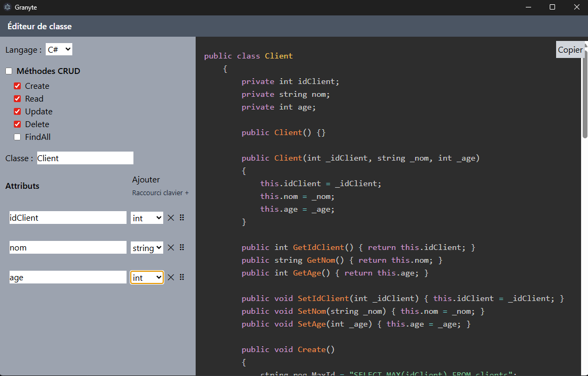

# Granyte

> Application permettant de générer des classes POO
> 

## Installation

1. Téléchargez la dernière version depuis la page [Releases](https://github.com/noe-dambreville/Generateur_classe/releases/latest)
2. Lancez le fichier `.exe`

## Fonctionnalités

### Générateur de classe
Générez automatiquement vos classes orientées objet à partir de vos attributs et de leurs types de données.

| Langage | Statut |
|---|---|
| C# | ☑ |
| PHP | ☑ |

## Développement

Prérequis : [Node.js](https://nodejs.org/) et npm.

```bash
git clone https://github.com/noe-dambreville/Granyte.git
```
```bash
cd Granyte
```
```bash
npm install
```
```bash
npm start
```
